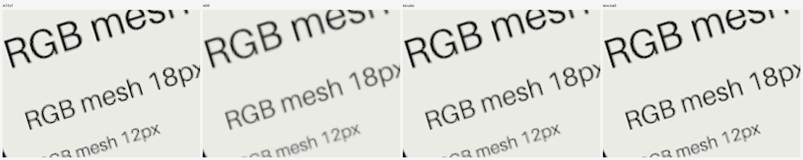
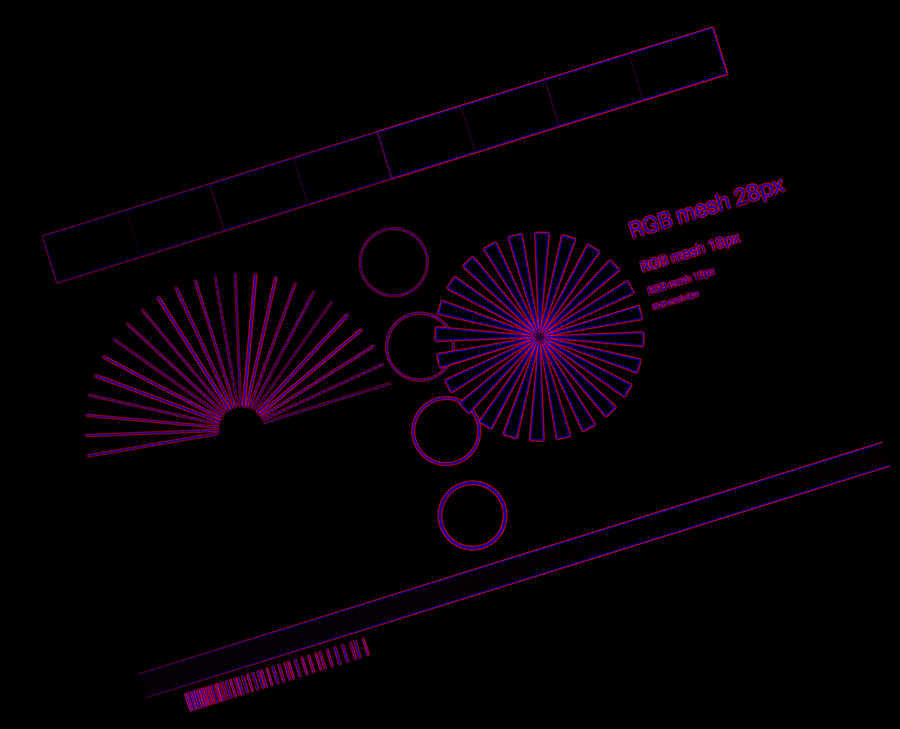

# RGB Mesh Resampling

Experimental image reconstruction and resampling based on a continuous RGB mesh built from pixel-centre samples.

The project explores a simple idea: instead of treating a raster pixel as a coloured square, treat its RGB value as a sample at the pixel centre, reconstruct a continuous local surface, and resample transformed output pixels by integrating that surface over their source-space footprints.

## Goal: make the image independent of its original pixel grid

The long-term goal is to separate the **image representation** from the square raster on which it happened to be sampled. The source pixel grid is used only as the initial measurement lattice. A simple representation transform converts pixel colours into coloured points, reconstructs shared edges and a continuous mesh, optionally recalibrates the mesh so each source pixel retains its measured area colour, and then allows the field to be refined without returning to the original raster.

In compact form:

```text
pixel grid
→ pixel colours
→ coloured point samples
→ reconstructed vertices and edges
→ continuous mesh
→ optional per-pixel area calibration
→ further points / edges / finer mesh
→ arbitrary output grid or pixel footprint
```


Once the continuous field exists, the original square grid is no longer privileged: the same image model can be integrated or sampled onto square, rotated, scaled, or other output grids and footprints.

The code and experiments are intended to make the method reproducible and to compare it against standard resampling methods without claiming that any one reconstruction is the unique ground truth for real photographs.

## Core model

For a source pixel value `P[i,j]`, the sample location is the pixel centre.

Each source pixel cell is reconstructed as a 9-node biquadratic (`Q2`) patch:

- 4 corner nodes,
- 4 edge-midpoint nodes,
- 1 centre node (the original pixel sample).

Corner nodes are reconstructed from the four surrounding pixel-centre samples. Edge-midpoint nodes are reconstructed from the two adjacent pixel centres and the two edge endpoints.

The diagram below shows the geometric idea on a 2×2 neighbourhood. The four raster values are first treated as samples located at the **pixel centres**, rather than as four filled squares. From those samples, shared corner and edge-midpoint values are reconstructed, creating the control structure of the continuous mesh.


The surface on the right is a visual analogy: one colour channel can be drawn as a height field, where sample value becomes height. In the actual implementation there is no single scalar “image height”; the same geometry carries the linear-light **R, G and B values independently** (and premultiplied alpha when present). Repeating this local construction across the image produces a continuous field whose geometry is no longer tied to the original pixel-square boundaries.

The resulting 3×3 node set defines a tensor-product quadratic surface in linear-light RGB.

Two main variants are studied:

- **raw Q2** — no area correction;
- **conservative Q2** — the centre node is adjusted once so that the exact area average of the Q2 cell equals the original source pixel value.

For a unit cell with corner sum `ΣV`, edge-midpoint sum `ΣE`, and centre `C`, the Q2 cell average is

```text
A = (ΣV + 4 ΣE + 16 C) / 36
```

and the conservative centre correction is

```text
C' = C + (36/16) (P - A)
```

No intermediate clamping is required; calculations are performed in floating-point linear light.

## Resampling

An output pixel is treated as an area footprint, not just a point.

For an affine transform, the output pixel footprint is inverse-mapped into source coordinates and the reconstructed field is averaged over that footprint:

```text
P_out = (1 / area(Ω)) ∫∫_Ω C(x,y) dx dy
```

This allows the same continuous field to be used for rotation, translation, scaling, and combined affine transforms.

## Refinement experiments

The repository also studies denser explicit representations of the same reconstructed field:

- 9-node Q2,
- 13-node centre-fan triangulation,
- 25-node subdivided Q2 representation,
- 41-node centre-fan triangulation.

The numbers refer to the **explicit point set used inside one original pixel cell**. The 9-point model is the basic 3×3 Q2 layout; 13 adds the four quarter-cell centres; 25 forms a regular 5×5 quarter-grid; and 41 adds the centre of each of the 16 refined subcells to that 25-point grid.


These are not four different source images or four levels of recovered detail. They are different explicit representations or refinements of the same local reconstructed field. In particular, the 25-point Q2 subdivision of a fixed 9-point Q2 surface adds sampling density but no new information.

A key distinction is kept between:

1. **subdivision of a fixed reconstructed field**, and
2. **re-calibration after refinement**, which creates a different field.

The 25-node Q2 subdivision of a fixed Q2 surface is numerically equivalent to the original 9-node Q2 representation.

## Choosing calibrated or uncalibrated mesh

Z / area calibration is not only a conservation constraint; in practice it also restores local edge and thin-feature contrast that the smooth uncalibrated mesh tends to reduce.

- **Calibrated variants** (`m09z`, and the final-grid `m13zf` / `m25zf` / `m41zf`) are intended when preserving source-pixel area colour, edge contrast and thin-feature energy is the priority.
- **Uncalibrated variants** (`m09`, `m13`, `m41`; the experimental `m25` is equivalent to `m09`) produce a visibly softer, smoother edge character. This can be aesthetically preferable when a gentle anti-aliased look is wanted rather than maximum local contrast.
- The experimental inherited-Z refinements `m09z_13`, `m09z_25` and `m09z_41` refine a 9-node calibrated field. `m09z_25` is exactly equivalent to `m09z` and is therefore not exposed separately by the demo.

So “uncalibrated” should not be read as “bad”: it is a different reconstruction choice. Calibration moves the result toward area/contrast preservation; leaving it off deliberately keeps the naturally smoother mesh response.

## Validation

The experimental framework uses both real images and analytically generated scenes with known geometry. Measurements include:

- PSNR / SSIM / ΔE,
- colour bias and saturation preservation,
- edge width and overshoot,
- thin-line thickness and peak contrast,
- positional and shape deformation,
- grid-dependent wobble,
- Siemens-star behaviour,
- round-trip and cumulative-transform error.

The conservative correction is also analysed directly through the difference between corrected and uncorrected fields.

## Status

This repository is an experimental research implementation. The mathematical construction is documented in [METHOD.md](METHOD.md).

A detailed discussion of the current synthetic and photographic benchmark, including cases where classical methods perform better, is available in [RESULTS.md](RESULTS.md).

A small runnable reference implementation and demo script are included (see below). The complete benchmark code used during development is being prepared for publication.

## Try it: demo script

Requirements: Python ≥ 3.10, `numpy`, `numba`, `pillow`.

```bash
pip install -r requirements.txt

python demo.py photo.jpg --rotate 17.3                 # rotate by any angle (default method m13zf)
python demo.py photo.jpg --scale 3                     # enlarge
python demo.py photo.jpg --scale 0.37                  # reduce
python demo.py photo.jpg --resize 1920x1080            # exact output size
python demo.py photo.jpg --rotate 30 --scale 2 --rotate -12 --translate 0.5 0 -o out.png
```

Operations are applied in the order given and **composed in continuous coordinates**: the mesh is built once and the output is rasterized once. The file is written as PNG with transparency outside the transformed image, or use `--background white` / `#rrggbb`.

Compare methods on the same transform and write a side-by-side sheet of a crop:

```bash
python demo.py photo.jpg --rotate 17.3 --scale 1.5 \
       --compare m13zf m09 bicubic lanczos3 --crop 1160 380 200 150 --crop-zoom 3
```



Other options:

| option | effect |
|---|---|
| `--method M` | `m13zf` (default), `m41zf`, `m25zf`, `m09z`, `m09`, `m13`, `m41`, `m09z_13`, `m09z_41`, `box`, `tent`, `bilinear`, `bicubic`, `lanczos3`, `nearest`; append `@pt` to a mesh for point sampling (`--list-methods`) |
| `--zdiff` | also write the calibrated-minus-uncalibrated image (the Laplacian-like correction field) |
| `--roundtrip` | apply the inverse transform to the re-rasterized output and report PSNR against the original |
| `--repeat N` | apply the chain N times, once composed and once re-rasterized after every step; if the total is the identity (e.g. `--rotate 30 --repeat 12`), report PSNR of both |
| `--canvas expand\|same\|WxH` | output canvas: bounding box of the transformed image (default), original size, or explicit size |
| `--float32` | store the mesh in float32 to halve memory |
| `--make-test-image chart.png` | generate a synthetic chart (thin lines at many angles, rings, Siemens star, text, colour bars) |

`--zdiff` on the test chart (red: the calibration brightens, blue: it darkens):



Composing instead of re-rasterizing, on the test chart with `--rotate 30 --repeat 12`:

```text
chain is the identity -> PSNR vs original: composed 259.58 dB, re-rasterized 24.11 dB
```

### Library use

```python
import rgbmesh as rm

img, has_alpha = rm.load("photo.png")               # premultiplied linear-light RGBA, float64
H, W = img.shape[:2]
T = rm.Chain(W, H).rotate(17.3).scale(2.0).T         # composed affine, nothing rasterized yet
M, shape = rm.canvas(T, W, H, "expand")              # output-pixel -> source map, output size
field = rm.build_field("m13zf", img)                 # mesh + final-grid area calibration, built once
out = rm.render(field, "m13zf", M, shape)            # exact footprint integration
rm.save("out.png", out)
```

Notes:

- All processing is in linear light with premultiplied alpha; sRGB encoding and 8-bit quantization happen only when saving.
- Area integration is exact for every angle. Footprints are clipped against the mesh cells and triangles, and the pieces are integrated with a quadrature rule that is exact for the Q2 polynomial.
- The area outside the source image is treated as transparent, so the alpha channel is the exact geometric coverage of each output pixel.
- The first run compiles the Numba kernels, which takes about 20 s; later runs use the cache.
- Memory grows with the number of mesh points: about 250 bytes per source pixel for `m13zf` and about 1 kB for `m41zf` in float64. `--float32` halves this.
- Tests: `python -m pytest`.

## Related concepts

The method is related to, but not identical with:

- cell-centred to nodal reconstruction,
- Q2 finite-element interpolation,
- conservative remapping / finite-volume ideas,
- reconstruction filtering,
- area / footprint resampling.

A literature comparison is still needed before making any claim of novelty.

## License

MIT.
